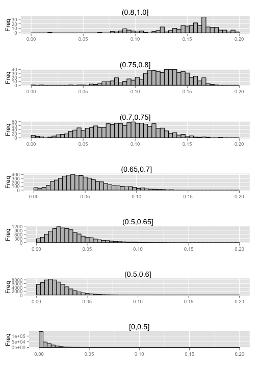

Part 2
=============================
Xiyang Dai
-----------------------------


```r
# load 'TxDb.Hsapiens.UCSC.hg19.knownGene'
library(TxDb.Hsapiens.UCSC.hg19.knownGene)
# reassign to shorter variable name
txdb <- TxDb.Hsapiens.UCSC.hg19.knownGene
# genes: GRanges object
allGenes <- genes(txdb)
# exons: GRanges object
allExons <- exons(txdb)
# transcripts: GRangesList object
allTranscriptsal <- transcripts(txdb)
# exons grouped by gene: GRangesList
exonsByGene <- exonsBy(txdb, by = "gene")
# transcripts grouped by gene: GRangesList
transcriptsByGene <- transcriptsBy(txdb, by = "gene")
# exons grouped by transcripts: GRangesList
exonsByTx <- exonsBy(txdb, by = "tx")
```


### Question 1 How many genes are there included in this annotation?

```r
length(allGenes$gene_id)
```

```
## [1] 23056
```

### Question 2 What is the average number of exons per gene?

```r
length(allExons$exon_id)/length(allGenes$gene_id)
```

```
## [1] 12.58
```

### Question 3 What is the number of transcripts per gene?

```r
length(allTranscriptsal$tx_id)/length(allGenes$gene_id)
```

```
## [1] 3.598
```

### Question 4 What is the exon length distribution?

```r
hist(allExons@ranges@width, breaks = 50, main = "Exon length distribution", 
    )
```

 

```r
# zoom the histogram in range [1:1000] for details
hist(subset(allExons@ranges@width, allExons@ranges@width < 1000), main = "Zoomed Exon length distribution", 
    breaks = 50)
```

 

### Question 5 What is the transcript length distribution?

```r
hist(allTranscriptsal@ranges@width, main = "Transcript length distribution", 
    breaks = 50)
```

 

```r
# zoom the histogram in range [1:10000] for details
hist(subset(allTranscriptsal@ranges@width, allTranscriptsal@ranges@width < 10000), 
    main = "Zoomed Transcript length distribution", breaks = 50)
```

 

### Question 6 What is the gene length distribution?

```r
hist(allGenes@ranges@width, main = "Gene length distribution", breaks = 50)
```

 

```r
# zoom the histogram in range [1:100000] for details
hist(subset(allGenes@ranges@width, allGenes@ranges@width < 1e+05), main = "Zoomed Gene length distribution", 
    breaks = 50)
```

 

### Question 7 How many genes overlap on opposite strands?

```r
pos_genes = subset(allGenes, allGenes@strand == "+")
neg_genes = subset(allGenes, allGenes@strand == "-")
ov = countOverlaps(pos_genes@ranges, neg_genes@ranges)
print(sum(ov > 0))
```

```
## [1] 11273
```

### Question 8 Does the gene length distribution differ across strands?

```r
ks.test(pos_genes@ranges@width, neg_genes@ranges@width)
```

```
## 
## 	Two-sample Kolmogorov-Smirnov test
## 
## data:  pos_genes@ranges@width and neg_genes@ranges@width
## D = 0.0119, p-value = 0.3893
## alternative hypothesis: two-sided
```

#### From the KS test result, we cannot say that the gene length distribution differ across strands.
### Exercise 1 Code that creates promoter regions.

```r
promoter_regions = promoters(allTranscriptsal, upstream = 1000, downstream = 200)
```

### Question 9 What percentage of UCSC CpG islands overlap promoter regions?

```r
library(AnnotationHub)
ah <- AnnotationHub()
cgi <- ah$goldenpath.hg19.database.cpgIslandExt_0.0.1.RData
ov2 = countOverlaps(cgi@ranges, promoter_regions@ranges)
print(sum(ov2 > 0)/length(ov2))
```

```
## [1] 0.7118
```


### Exercise 2. Compute the number of A,C,G,T over non-overlapping windows of length L=256.

```r
# load 'BSgenome.Hsapiens.UCSC.hg19'
library(BSgenome.Hsapiens.UCSC.hg19)
# now get chromosome 16 as a `DNAString` object
chr16 <- Hsapiens[["chr16"]]

# define window size L = 256
L = 256
non_ov = breakInChunks(length(chr16), L)
views = Views(chr16, non_ov)
ACGT = letterFrequency(views, c("A", "C", "G", "T"))
N_A = ACGT[, 1]
N_C = ACGT[, 2]
N_G = ACGT[, 3]
N_T = ACGT[, 4]
# Total number of ACGT
print(colSums(ACGT))
```

```
##        A        C        G        T 
## 21724083 17630040 17701988 21828642
```

```r
# Average number of ACGT
print(colMeans(ACGT))
```

```
##     A     C     G     T 
## 61.55 49.95 50.15 61.85
```


### Exercise 3. Compute the number of CG dinucleotides over non-overlapping windows of length L=256.

```r
N_CG = dinucleotideFrequency(views)[, 7]
hist(N_CG, breaks = 50)
```

 


### Exercise 4. Compute the observed/expected (O/E) ratio over non-overlapping windows of length L=256.

```r
OE = (N_CG/L)/((N_C/L) * (N_G/L))
hist(OE[OE <= 4], breaks = seq(0, 4, l = 50), xlim = c(0, 4))
```

 


### Exercise 5. Plot the GC content (N_C+N_G) inside and outside promoter regions.

```r
ov3 = countOverlaps(non_ov, promoter_regions@ranges)
inside_promoter_views = views[ov3 > 0]
outside_promoter_views = views[ov3 == 0]
GC_in = letterFrequency(inside_promoter_views, "CG")
hist(GC_in, breaks = 50)
```

 

```r
GC_out = letterFrequency(outside_promoter_views, "CG")
hist(GC_out, breaks = 50)
```

 


### Exercise 6. Plot the CpG content (N_CG) inside and outside promoter regions.

```r
CpG_in = dinucleotideFrequency(inside_promoter_views)[, 7]
hist(CpG_in, breaks = 50)
```

 

```r
CpG_out = dinucleotideFrequency(outside_promoter_views)[, 7]
hist(CpG_out, breaks = 50)
```

 


### Exercise 7. Plot the O/E ratio inside and outside the UCSC CpG islands.

```r
ov4 = countOverlaps(non_ov, cgi@ranges)
inside_cpg_views = views[ov4 > 0]
outside_cpg_views = views[ov4 == 0]
GC_in = letterFrequency(inside_cpg_views, c("C", "G"))
GC_out = letterFrequency(outside_cpg_views, c("C", "G"))
CpG_in = dinucleotideFrequency(inside_cpg_views)[, 7]
CpG_out = dinucleotideFrequency(outside_cpg_views)[, 7]
OE_in = (CpG_in/L)/((GC_in[, 1]/L) * (GC_in[, 2]/L))
hist(OE_in[OE_in <= 4], breaks = seq(0, 4, l = 50), xlim = c(0, 4))
```

 

```r
OE_out = (CpG_out/L)/((GC_out[, 1]/L) * (GC_out[, 2]/L))
hist(OE_out[OE_out <= 4], breaks = seq(0, 4, l = 50), xlim = c(0, 4))
```

 


### Exercise 8. Plot the distribution of N_CG depends on the GC content (N_C + N_G) in a given window.

```r
# load extra libaray to draw a nice figure
library("gridExtra")
library("ggplot2")
GC_content = (N_C + N_G)/L
CpG_rate = N_CG/L
# plot multiple figure into one
p1 = qplot(CpG_rate[GC_content <= 0.5], geom = "histogram", xlim = c(0, 0.2), 
    xlab = "", ylab = "Freq", main = "[0,0.5]", binwidth = 0.004) + geom_histogram(colour = "black", 
    fill = "grey", binwidth = 0.004)
p2 = qplot(CpG_rate[GC_content > 0.5 & GC_content <= 0.6 & CpG_rate <= 0.2], 
    geom = "histogram", xlim = c(0, 0.2), xlab = "", ylab = "Freq", main = "(0.5,0.6]", 
    binwidth = 0.004) + geom_histogram(colour = "black", fill = "grey", binwidth = 0.004)
p3 = qplot(CpG_rate[GC_content > 0.6 & GC_content <= 0.65 & CpG_rate <= 0.2], 
    geom = "histogram", xlim = c(0, 0.2), xlab = "", ylab = "Freq", main = "(0.5,0.65]", 
    binwidth = 0.004) + geom_histogram(colour = "black", fill = "grey", binwidth = 0.004)
p4 = qplot(CpG_rate[GC_content > 0.65 & GC_content <= 0.7 & CpG_rate <= 0.2], 
    geom = "histogram", xlim = c(0, 0.2), xlab = "", ylab = "Freq", main = "(0.65,0.7]", 
    binwidth = 0.004) + geom_histogram(colour = "black", fill = "grey", binwidth = 0.004)
p5 = qplot(CpG_rate[GC_content > 0.7 & GC_content <= 0.75 & CpG_rate <= 0.2], 
    geom = "histogram", xlim = c(0, 0.2), xlab = "", ylab = "Freq", main = "(0.7,0.75]", 
    binwidth = 0.004) + geom_histogram(colour = "black", fill = "grey", binwidth = 0.004)
p6 = qplot(CpG_rate[GC_content > 0.75 & GC_content <= 0.8 & CpG_rate <= 0.2], 
    geom = "histogram", xlim = c(0, 0.2), xlab = "", ylab = "Freq", main = "(0.75,0.8]", 
    binwidth = 0.004) + geom_histogram(colour = "black", fill = "grey", binwidth = 0.004)
p7 = qplot(CpG_rate[GC_content > 0.8 & GC_content <= 1 & CpG_rate <= 0.2], geom = "histogram", 
    xlim = c(0, 0.2), xlab = "", ylab = "Freq", main = "(0.8,1.0]", binwidth = 0.004) + 
    geom_histogram(colour = "black", fill = "grey", binwidth = 0.004)
grid.arrange(p7, p6, p5, p4, p3, p2, p1, ncol = 1)
```

 

