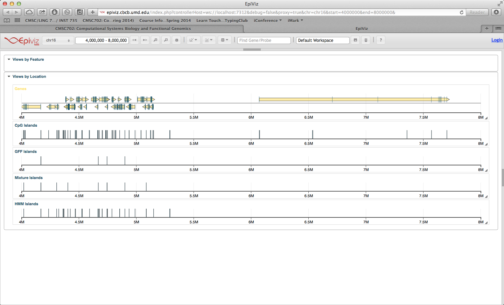
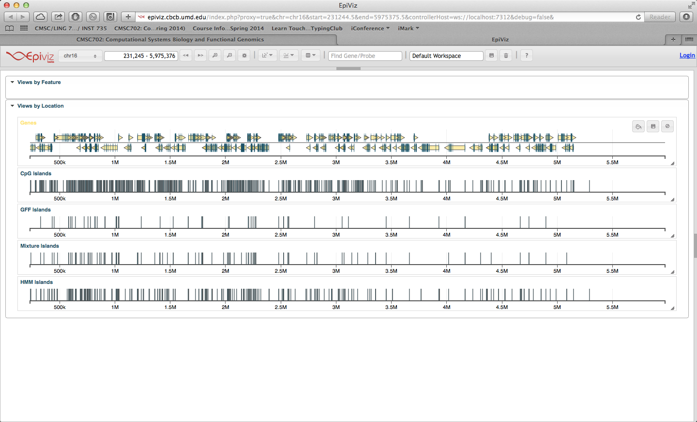
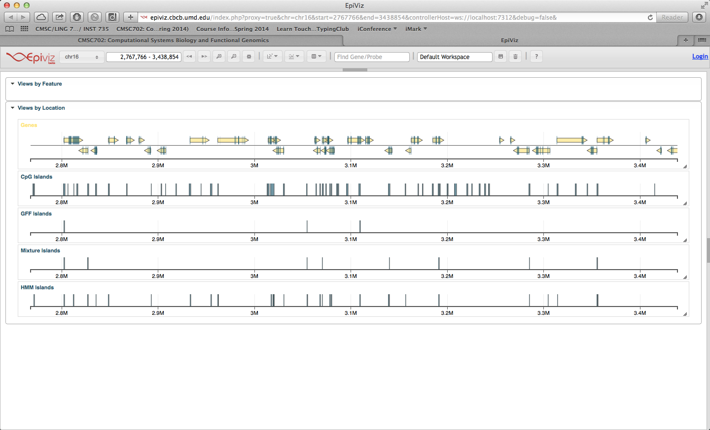

Part 3
=============================
Xiyang Dai
-----------------------------

### Exercise 1. Compute the statistics you will use for this part using the code you wrote in Part II, but now computing GC content and CpG content over non-overlapping windows of length L = 16.

```{r, message=FALSE, warning=FALSE}
library(AnnotationHub)
ah <- AnnotationHub()
cgi <- ah$goldenpath.hg19.database.cpgIslandExt_0.0.1.RData
cgi_chr16 = cgi[cgi@seqnames=="chr16"]

library(BSgenome.Hsapiens.UCSC.hg19)
# now get chromosome 16 as a `DNAString` object
chr16 <- Hsapiens[["chr16"]]

source("segmentGenome.R")

# do calculations for N_CG, O/E, GC_content and CpG_rate
L = 16
windows = breakInChunks(length(chr16), L)
views = Views(chr16, windows)
ACGT = letterFrequency(views, c("A","C","G","T"))
N_C = ACGT[,2]
N_G = ACGT[,3]
N_CG = dinucleotideFrequency(views)[,7]
OE = (N_CG/L)/((N_C/L)*(N_G/L))
OE[is.nan(OE)] = 0
GC_content = (N_C + N_G)/L
CpG_rate = N_CG/L
```

### Exercise 2. Compare and discuss the overlap between these islands and the UCSC islands you downloaded in Part II.
```{r, message=FALSE, warning=FALSE}
gff_rule= as.numeric(GC_content>0.5 & OE>0.6)
GFFislands = segmentGenome(gff_rule, L)

# calculate overlaps
ov = countOverlaps(GFFislands@ranges, cgi_chr16@ranges)
```
Get overlap statistics:
```{r, message=FALSE, warning=FALSE}
# The number of GFF islands
print(sum(ov[ov>0]))

# The overlaps percentage between GFF islands and the UCSC islands
print(sum(ov[ov>0])/length(ov))

# The average length of GFF islands
print(mean(GFFislands@ranges@width))
```
#### Discussion
* Just using GFF rule, we can get 174 CpG islands.
* The overlap percentage with USCS islands is about 87.36%
* The average length of GFF islands is 263.8

### A simple conditional state (mixture) model
```{r, message=FALSE, warning=FALSE}
source("simpleMixtureCGI.R")

# calculate P(s)
P = 1/2*(N_C/L + N_G/L)
P = P^2

#simpleMix = simpleMixtureCGI(N_CG, P, L)
mixtureIslands = segmentGenome(simpleMix$y, L)

# calculate overlaps
ov2 = countOverlaps(mixtureIslands@ranges, cgi_chr16@ranges)
```
Get overlap statistics:
```{r, message=FALSE, warning=FALSE}
# The number of mixture islands
print(sum(ov2[ov2>0]))

# The overlaps percentage between mixture islands and the UCSC islands
print(sum(ov2[ov2>0])/length(ov2))

# The Average length of mixture islands
print(mean(mixtureIslands@ranges@width))
```
#### Discussion
* Using mixture model, we can get 288 CpG islands.
* The overlap percentage with USCS islands is about 92.9%, which is higher than GFF rule.
* The average length of mixture islands is 274.2, which is longer that the GFF islands.
* a1 is about 0.89, a0 is about 0.02. The values of a0 and a1 are more reasonable than GFF rule.
* In order to use GC-content to define CpG Islands, we can use this criterion as a filter to index the data we want to use. In practice, we can easily modify the checking island condition "pi*dbinom(ncg, L, p*a1)>(1-pi)*dbinom(ncg, L, p*a0)" with an extra condition ncg>0.5.

### An HMM for CpG Island finding
```{r, message=FALSE, warning=FALSE}
source("hmmCGI.R")

#hmmMix = hmmCGI(N_CG, P, L)
hmmIslands = segmentGenome(hmmMix$y, L)

# calculate overlaps
ov3 = countOverlaps(hmmIslands@ranges, cgi_chr16@ranges)
```
Get overlap statistics:
```{r, message=FALSE, warning=FALSE}
# The number of hmm islands
print(sum(ov3[ov3>0]))

# The overlaps percentage between mixture islands and the UCSC islands
print(sum(ov3[ov3>0])/length(ov3))

# The Average length of mixture islands
print(mean(hmmIslands@ranges@width))
```

Compare with promoter regions
```{r, message=FALSE, warning=FALSE}
library(TxDb.Hsapiens.UCSC.hg19.knownGene)
txdb <- TxDb.Hsapiens.UCSC.hg19.knownGene
allTranscriptsal <- transcripts(txdb)
promoter_regions = promoters(allTranscriptsal, upstream=1000, downstream=200)
```

```{r, message=FALSE, warning=FALSE}
# The overlaps percentage between GFF islands and promoter regions
ov_gff = countOverlaps(GFFislands@ranges, promoter_regions@ranges)
print(length(ov_gff[ov_gff>0])/length(ov_gff))

# The overlaps percentage between mixture islands and promoter regions
ov_mx = countOverlaps(mixtureIslands@ranges, promoter_regions@ranges)
print(length(ov_mx[ov_mx>0])/length(ov_mx))

# The overlaps percentage between HMM islands and promoter regions
ov_hmm = countOverlaps(hmmIslands@ranges, promoter_regions@ranges)
print(length(ov_hmm[ov_hmm>0])/length(ov_hmm))

# The overlaps percentage between UCSC islands and promoter regions
ov_cgi = countOverlaps(cgi_chr16@ranges, promoter_regions@ranges)
print(length(ov_cgi[ov_cgi>0])/length(ov_cgi))

```

Compare the distance between resulting island and nearest transcription start sites
```{r, message=FALSE, warning=FALSE}
# The average distance between GFF island and nearest transcription start sites
nn_gff = nearest(GFFislands[ov>0],allTranscriptsal)
print(mean(abs(GFFislands@ranges@start[ov>0]-allTranscriptsal@ranges@start[nn_gff])))

# The average distance between mixture island and nearest transcription start sites
nn_mx = nearest(mixtureIslands[ov2>0],allTranscriptsal)
print(mean(abs(mixtureIslands@ranges@start[ov2>0]-allTranscriptsal@ranges@start[nn_mx])))

# The average distance between hmm island and nearest transcription start sites
nn_hmm = nearest(hmmIslands[ov3>0],allTranscriptsal)
print(mean(abs(hmmIslands@ranges@start[ov3>0]-allTranscriptsal@ranges@start[nn_hmm])))

```
#### Discussion
* Using hmm model, we can get 861 CpG islands, which is the most among these three model.
* The overlap percentage with USCS islands is about 92.8%, which is as good as mixture model.
* The average length of mixture islands is 319.5, which is the longest among these three model.
* In hmm model, a1 is about 0.82, a0 is about 0.000066. 
* Compared on the ovelaps of the promoter regions, the overlap of hmm model (about 78.88%) is the closest to the UCSC CpG islands data (about 70.56%). The overlap of mixture model is about 80.65% and the overlap of GFF rule is about 79.31% 
* Compared on distances between resulting islands and the nearest TSS, the hmm model has the least average distance (28937.11). The average distance of mixture model is 29961.34 and the distance of GFF rule is 30631.75.

#### Conclusion
Compared with other methods, the hmm model has the most CpG islands found and longest average length with the same good overlap with UCSC CpG islands data (which we use as a groudtruth data) as mixure model. Also the overlap with promoter regions is the closest to the UCSC CpG islands data. Meanwhile, the hmm model has the least average distance between resulting islands and the nearest TSS. Hence, we can say that the hmm model is the best model among these three models. 

### Visualize and Compare
```{r, eval=FALSE}
# visualize the result
require(epivizr)

# this requires internet access
mgr <- startEpiviz(chr="chr16", start=4000000, end=8000000)
gffDev <- mgr$addDevice(GFFislands, "GFF Islands")
mixtureDev <- mgr$addDevice(mixtureIslands, "Mixture Islands")
hmmDev <- mgr$addDevice(hmmIslands, "HMM Islands")
mgr$service()
# you can navigate around chr16 on your web browser
# run this when done
mgr$stopServer()
```



We visualize our results using "epivizr" package, which provides a good way to compare the diffrences.


From the above figure, we can easily see that the hmm model finds much more CpG islands then other two methods.


Also, after zoom in, we can also see that the hmm model can also find longer CpG islands the other two methods.
The figures from the visulization tool prove our statistical conclusions.